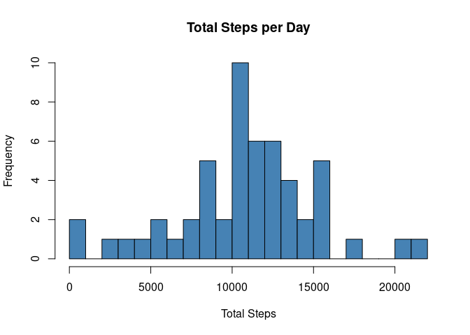
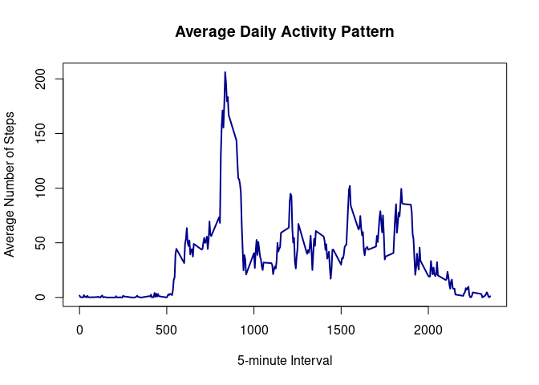
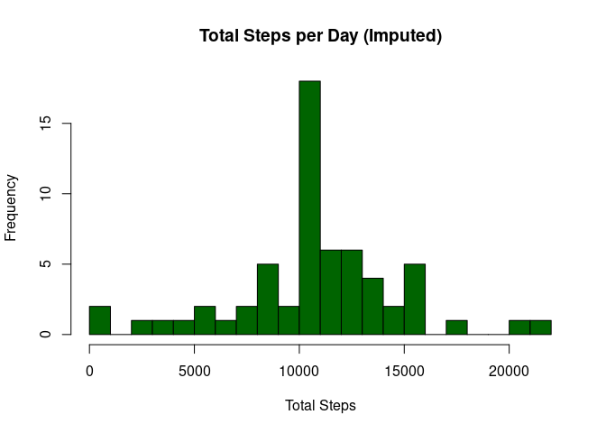
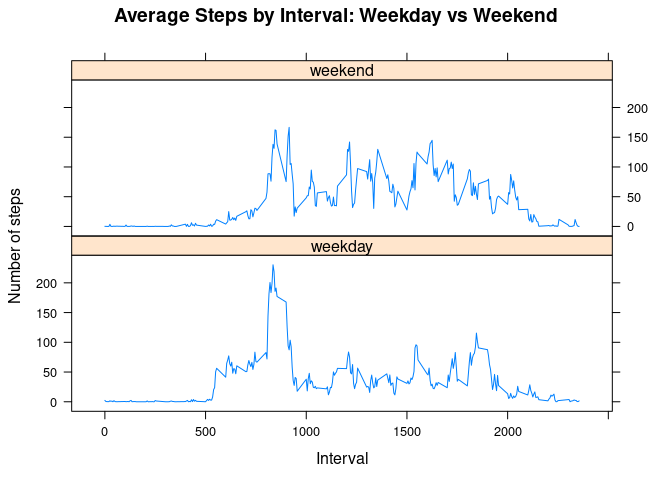

## Loading and preprocessing the data


```r
activity <- read.csv("activity.csv", stringsAsFactors = FALSE)
activity$date <- as.Date(activity$date, format = "%Y-%m-%d")
```

## What is mean total number of steps taken per day?


```r
daily_steps <- aggregate(steps ~ date, data = activity, sum, na.rm = TRUE)

hist(daily_steps$steps, main = "Total Steps per Day", 
     xlab = "Total Steps", col = "steelblue", breaks = 20)
```

<!-- -->


```r
mean_steps <- mean(daily_steps$steps)
median_steps <- median(daily_steps$steps)
mean_steps
```

```
## [1] 10766.19
```

```r
median_steps
```

```
## [1] 10765
```

The mean total number of steps taken per day is 10,766.19 and the median is 10,765.

## What is the average daily activity pattern?


```r
interval_avg <- aggregate(steps ~ interval, data = activity, mean, na.rm = TRUE)

plot(interval_avg$interval, interval_avg$steps, type = "l",
     xlab = "5-minute Interval", ylab = "Average Number of Steps",
     main = "Average Daily Activity Pattern", col = "darkblue", lwd = 2)
```

<!-- -->


```r
max_interval <- interval_avg$interval[which.max(interval_avg$steps)]
max_interval
```

```
## [1] 835
```

The 5-minute interval with the maximum average number of steps is interval 835.

## Imputing missing values


```r
total_na <- sum(is.na(activity$steps))
total_na
```

```
## [1] 2304
```

The total number of rows with missing values is 2304.

**Imputation strategy:** Replace each NA with the mean number of steps for that 5-minute interval, computed across all days.


```r
activity_imputed <- activity

for (i in 1:nrow(activity_imputed)) {
    if (is.na(activity_imputed$steps[i])) {
        interval_val <- activity_imputed$interval[i]
        activity_imputed$steps[i] <- interval_avg$steps[interval_avg$interval == interval_val]
    }
}

sum(is.na(activity_imputed$steps))
```

```
## [1] 0
```


```r
daily_steps_imputed <- aggregate(steps ~ date, data = activity_imputed, sum)

hist(daily_steps_imputed$steps, main = "Total Steps per Day (Imputed)", 
     xlab = "Total Steps", col = "darkgreen", breaks = 20)
```

<!-- -->


```r
mean_steps_imputed <- mean(daily_steps_imputed$steps)
median_steps_imputed <- median(daily_steps_imputed$steps)
mean_steps_imputed
```

```
## [1] 10766.19
```

```r
median_steps_imputed
```

```
## [1] 10766.19
```

After imputation, the mean is 10,766.19 and the median is 10,766.19. 

Comparing to the original estimates (mean = 10,766.19, median = 10,765): the mean is unchanged (since we imputed with interval means, which doesn't shift the overall average), but the median shifts slightly toward the mean. The total daily step counts increase overall because previously NA-containing days (which summed to 0 with `na.rm=TRUE`) now have realistic step values, increasing the frequency of days near the mean and reducing the spike at 0.

## Are there differences in activity patterns between weekdays and weekends?


```r
activity_imputed$day_type <- ifelse(weekdays(activity_imputed$date) %in% c("Saturday", "Sunday"),
                                     "weekend", "weekday")
activity_imputed$day_type <- factor(activity_imputed$day_type, levels = c("weekday", "weekend"))
```


```r
library(lattice)

interval_avg_daytype <- aggregate(steps ~ interval + day_type, data = activity_imputed, mean)

xyplot(steps ~ interval | day_type, data = interval_avg_daytype, 
       type = "l", layout = c(1, 2),
       xlab = "Interval", ylab = "Number of steps",
       main = "Average Steps by Interval: Weekday vs Weekend")
```

<!-- -->
